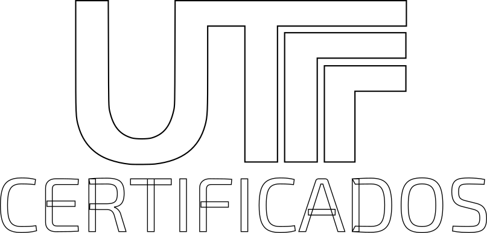
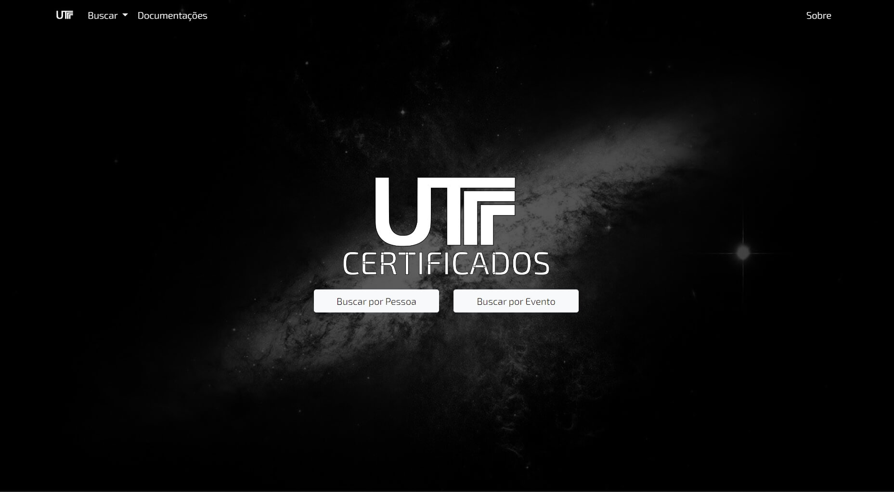

# utfCerts

<br />
<p align="center">
  <a href="https://github.com/pradoplucas/utfCerts">
    
  </a>

  <p align="center">
    Este projeto é parte de um sistema maior desenvolvido como Trabalho de Conclusão de Curso (TCC) no curso de Engenharia de Computação na Universidade Tecnológica Federal do Paraná câmpus Cornélio Procópio (UTFPR-CP), e que posteriormente foi aderido como ferramenta auxiliar para a busca de certificados dentro da universidade.
    <br />
    <br />
    <a href="http://certificados.cp.utfpr.edu.br"><strong>UTF Certificados »</strong></a>
    <br />
    <a href="http://certificados.cp.utfpr.edu.br">http://certificados.cp.utfpr.edu.br</a>
    <br />
    <br />
    
    <a href="https://github.com/pradoplucas/utfCerts">Ver Projeto</a>
    ·
    <a href="https://github.com/pradoplucas/utfCerts/issues">Reportar Bug</a>
    ·
    <a href="https://github.com/pradoplucas/utfCerts/issues">Requisitar Funcionalidade</a>
  </p>
</p>

## 💻 Pré-requisitos

### O projeto pode ser dividido em duas partes: 
- o sistema _web_, que está neste repositório ([utfCerts](https://github.com/pradoplucas/utfCerts))
- o _bot_ do banco de dados, que está no repositório [sgceScripts](https://github.com/pradoplucas/sgceScripts)

### Primeiramente, inicie o Banco de Dados
Vá até o repositório do _bot_ ([sgceScripts](https://github.com/pradoplucas/sgceScripts)) que é responsável pelo banco de dados, e siga as instruções descritas lá.

### Depois, verifique os requisitos
Confira se você já têm instalado:
- `Node.js`, juntamente com o `npm`
- `MongoDB`, juntamente com o `MongoDB Shell`
- `git`

## 🚀 Instalando

### Clonando

- Clone o repositório

    ```sh
    git clone https://github.com/pradoplucas/utfCerts.git
    ```

### Instalando

- Instale os pacotes npm

    ```sh
    npm install
    ```

### Configurando

- Observe o arquivo `.envConfig`

- Crie um arquivo `.env` 

- No arquivo `.env`, inicie as variáveis de ambiente de acordo com arquivo `.envConfig`


## ☕ Usando

- Execute o servidor

    ```sh
    node server.js
    ```

- Se a resposta for exatamente como a descrita abaixo, então está tudo ok

    ```
    ##### -- Server Running: Success
    Link: http://localhost:8022

    ##### -- MongoDB Connect: Success
    ```

- Abra o navegador e entre no seguinte link 
  - http://localhost:8022


## 📫 Contribuindo

As contribuições são o que tornam a comunidade _open source_ um lugar tão incrível para aprender, inspirar e criar. Quaisquer contribuições que você fizer serão **muito bem-vindas**.

Para contribuir com o projeto, siga estas etapas:

1. Dê _fork_ neste repositório;
2. Crie uma _branch_: `git checkout -b <nome_branch>`.;
3. Faça suas alterações e confirme-as: `git commit -m '<mensagem_commit>'`;
4. Envie para a _branch_ original: `git push origin <nome_do_projeto> / <local>`;
5. Crie a solicitação de _pull_.

Como alternativa, consulte a documentação do GitHub em [como criar uma solicitação pull](https://help.github.com/en/github/collaborating-with-issues-and-pull-requests/creating-a-pull-request).

## 🤝 Contato

### Lucas do Prado Pinto (lucaspinto@alunos.utfpr.edu.br)
- [Página Pessoal](https://pradoplucas.github.io/)
- [GitHub](https://github.com/pradoplucas/)
- [Linkedin](https://www.linkedin.com/in/pradoplucas/)
- [Lattes](http://lattes.cnpq.br/7589155295539184)
- [Instagram](https://www.instagram.com/pradoplucas/)
- [Facebook](https://www.facebook.com/pradoplucas)
- [Twitter](https://twitter.com/pradoplucas)

## 📝 Licença

Esse projeto está sob a licença MIT. Veja o arquivo [LICENÇA](LICENSE.md) para mais detalhes.

[⬆ Voltar ao topo](#utfcerts)<br>